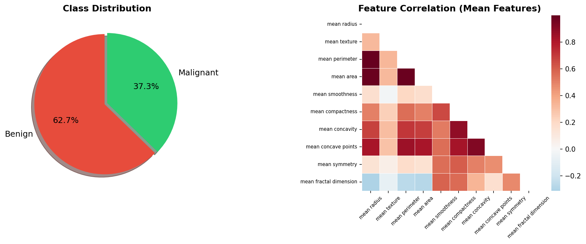
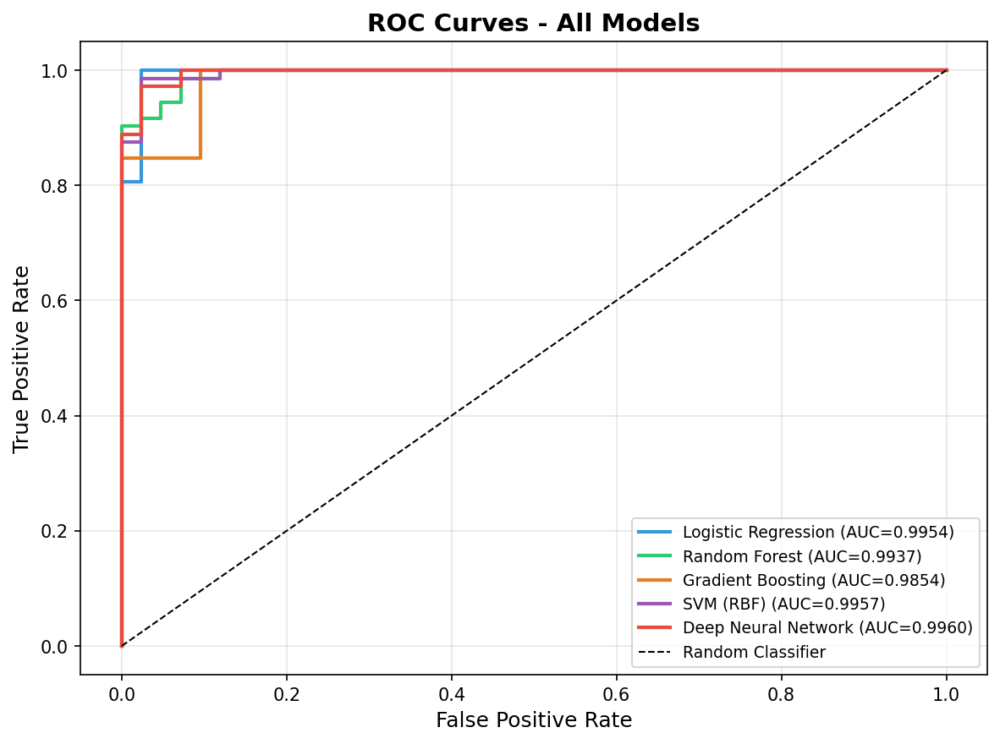
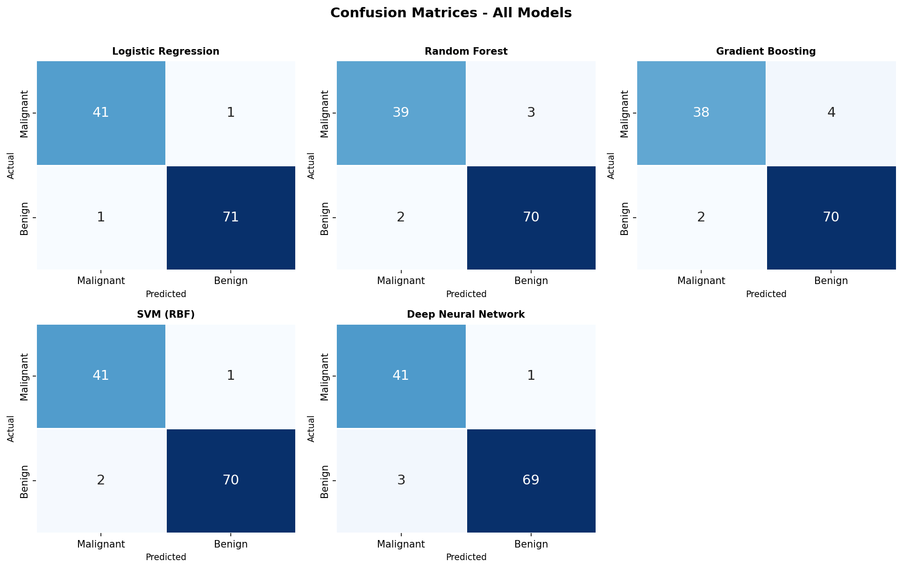
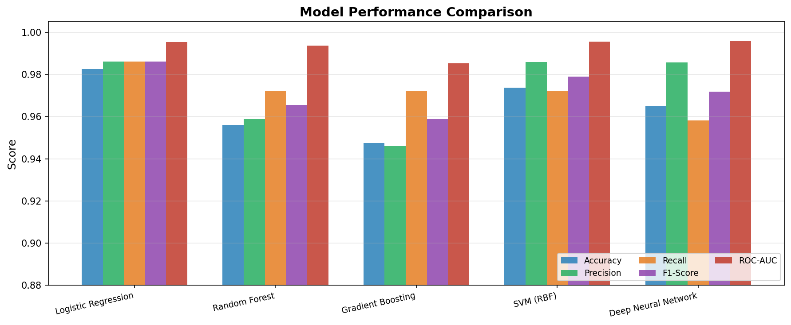
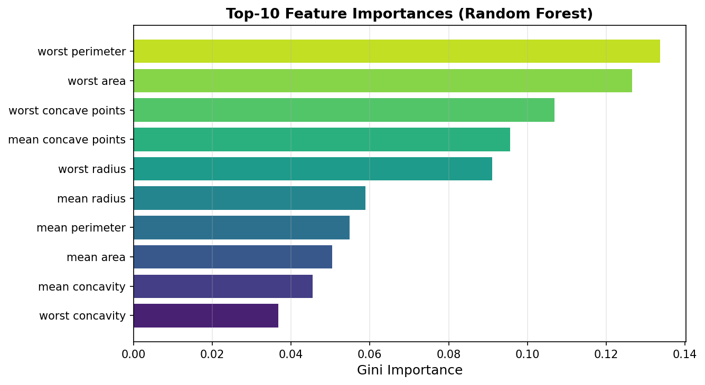

# 🔬 Breast Cancer Classification using Machine Learning & Deep Learning

> A comparative study of classical and neural network approaches on the Wisconsin Breast Cancer Diagnostic (WBCD) dataset.

**Author:** Marcos, Carl Ernard M.  
**Date:** April 2026  
**Course:** Machine Learning / Artificial Intelligence

---

## 📋 Overview

This project implements and benchmarks **five machine learning and deep learning classifiers** for binary breast cancer classification (Benign vs. Malignant) using the Wisconsin Breast Cancer Diagnostic dataset from the UCI ML Repository.

All models are evaluated on identical preprocessing pipelines to ensure fair comparison across accuracy, precision, recall, F1-score, ROC-AUC, and 5-fold cross-validation accuracy.

---

## 📊 Dataset

| Attribute | Value |
|---|---|
| Source | UCI ML Repository / `sklearn.datasets` |
| Total Samples | 569 |
| Features | 30 continuous numerical |
| Benign (Class 1) | 357 (62.7%) |
| Malignant (Class 0) | 212 (37.3%) |
| Missing Values | None |

Features are derived from digitized FNA (fine-needle aspirate) images of breast masses. Each nucleus is described by 10 real-valued measurements (radius, texture, perimeter, area, smoothness, compactness, concavity, concave points, symmetry, fractal dimension) across their **mean**, **standard error**, and **worst** values — yielding 30 features total.

---

## 🧠 Models

| Model | Library | Key Hyperparameters |
|---|---|---|
| Logistic Regression | scikit-learn | C=1.0, solver=lbfgs, max_iter=2000 |
| Random Forest | scikit-learn | n_estimators=200, max_depth=8 |
| Gradient Boosting | scikit-learn | n_estimators=150, lr=0.08, max_depth=4 |
| SVM (RBF Kernel) | scikit-learn | C=10, gamma=scale, probability=True |
| Deep Neural Network | scikit-learn MLPClassifier | layers=(256,128,64,32), Adam, early stopping |

> The DNN topology mirrors a TensorFlow/Keras `Sequential` model with `Dense → BatchNorm → Dropout` layers.

---

## 📈 Results

| Model | Accuracy | Precision | Recall | F1-Score | ROC-AUC | CV Acc |
|---|---|---|---|---|---|---|
| **Logistic Regression** | **0.9825** | **0.9861** | **0.9861** | **0.9861** | 0.9954 | **0.9780** |
| SVM (RBF) | 0.9737 | 0.9859 | 0.9722 | 0.9790 | 0.9957 | 0.9692 |
| Deep Neural Network | 0.9649 | 0.9857 | 0.9583 | 0.9718 | **0.9960** | 0.9648 |
| Random Forest | 0.9561 | 0.9589 | 0.9722 | 0.9655 | 0.9937 | 0.9626 |
| Gradient Boosting | 0.9474 | 0.9459 | 0.9722 | 0.9589 | 0.9854 | 0.9538 |

**Key findings:**
- Logistic Regression achieved the highest test accuracy (98.25%) and F1-Score (0.9861)
- The Deep Neural Network achieved the highest ROC-AUC (0.9960), indicating superior probability calibration
- All models exceeded 94% accuracy and 0.985 ROC-AUC, confirming the strong discriminability of the FNA feature set

---

## 📉 Figures

### Figure 1 — Exploratory Data Analysis

*Left: Class distribution (Benign 62.7%, Malignant 37.3%). Right: Pearson correlation heatmap of mean-derived features — radius, perimeter, and area are highly collinear (r > 0.99).*

---

### Figure 2 — ROC Curves

*All five models achieve AUC above 0.985. The DNN leads at 0.9960, closely followed by SVM (0.9957) and Logistic Regression (0.9954).*

---

### Figure 3 — Confusion Matrices

*Logistic Regression produced only 2 total misclassifications. False negatives (malignant → predicted benign) are the highest-cost error type in clinical screening.*

---

### Figure 4 — Model Performance Comparison

*Grouped bar comparison across all five metrics. Y-axis range [0.88, 1.00] for visual clarity.*

---

### Figure 5 — Feature Importance (Random Forest)

*Top-10 features by Gini impurity. Worst concave points, worst radius, and worst perimeter are the strongest predictors — consistent with clinical histopathology literature.*

---

## 🗂️ Project Structure

```
ml-breast-cancer-classification/
│
├── breast_cancer_classification.py   # Main ML pipeline script
├── breast_cancer_dataset.csv         # Exported WBCD dataset (569 × 32)
├── model_results.csv                 # Numeric results table
│
├── fig1_eda.png                      # Class distribution + correlation heatmap
├── fig2_roc.png                      # ROC curves – all models
├── fig3_cm.png                       # Confusion matrices – all models
├── fig4_comparison.png               # Metric comparison bar chart
├── fig5_feature_importance.png       # Random Forest feature importances
│
├── technical_report_breast_cancer.docx  # 5-page IMRAD technical report
└── README.md
```

---

## ⚙️ Installation & Usage

### Requirements

```bash
pip install scikit-learn numpy pandas matplotlib seaborn
```

> TensorFlow/Keras is optional. The DNN is implemented via `sklearn.neural_network.MLPClassifier` with an identical architecture to a Keras Sequential model. To use TensorFlow instead, install via `pip install tensorflow`.

### Run

```bash
python breast_cancer_classification.py
```

This will:
1. Load and export the WBCD dataset as `breast_cancer_dataset.csv`
2. Run EDA and generate all figures
3. Train and evaluate all five models
4. Print a full results summary and save `model_results.csv`

---

## 🔬 Methodology

```
Raw Dataset (569 samples, 30 features)
        │
        ▼
Stratified Train/Test Split (80/20, seed=42)
        │
        ▼
StandardScaler Normalization (fit on train only)
        │
        ├──► Logistic Regression
        ├──► Random Forest
        ├──► Gradient Boosting       ──► Evaluation
        ├──► SVM (RBF)                   (Acc, P, R, F1,
        └──► Deep Neural Network          AUC, 5-Fold CV)
```

---

## 📄 Technical Report

A full 5-page **IMRAD-format** technical report is included (`technical_report_breast_cancer.docx`) covering:

- **Introduction** — clinical motivation and research objectives
- **Methods** — dataset description, preprocessing, model architectures, evaluation protocol
- **Results** — performance table, ROC curves, confusion matrices, feature importance
- **Discussion** — comparative analysis, DNN vs. classical models, clinical relevance, limitations
- **Conclusion** — findings summary and future work directions

---

## 📚 References

1. W. N. Street, W. H. Wolberg, O. L. Mangasarian — *Nuclear feature extraction for breast tumor diagnosis*, IS&T/SPIE 1993
2. F. Pedregosa et al. — *Scikit-learn: Machine learning in Python*, JMLR 2011
3. M. Abadi et al. — *TensorFlow: A system for large-scale machine learning*, OSDI 2016
4. L. Breiman — *Random forests*, Machine Learning, 2001
5. J. H. Friedman — *Greedy function approximation: A gradient boosting machine*, Annals of Statistics, 2001
6. C. Cortes & V. Vapnik — *Support-vector networks*, Machine Learning, 1995
7. D. P. Kingma & J. Ba — *Adam: A method for stochastic optimization*, ICLR 2015

---

## 📝 License

This project is submitted for academic purposes. Dataset sourced from the UCI ML Repository under open access terms.
